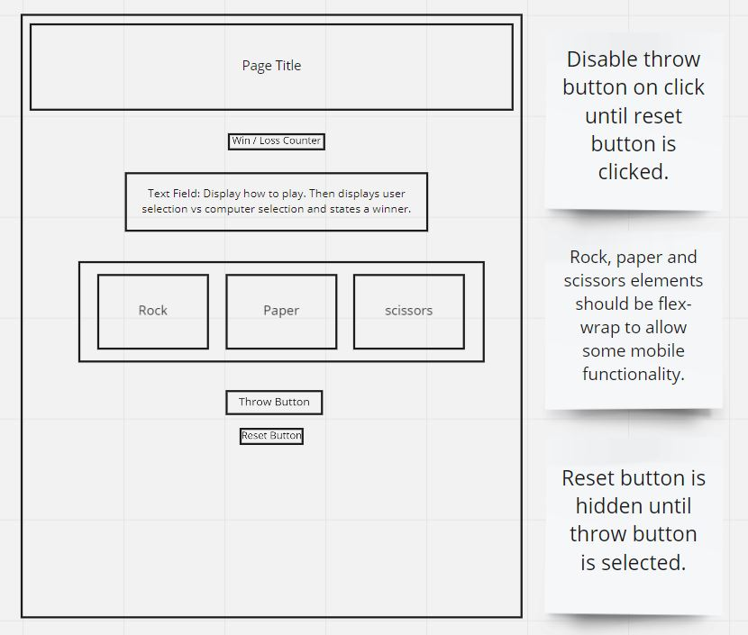

## Making a plan
1) Make a drawing of your app. Simple "wireframes"
2) Once you have a drawing, name the HTML elements you'll need to realize your vision
3) For each HTML element ask: Why do I need this?
4) Once we know _why_ we need each element, think about how to implement the "Why" as a "How"
5) Is there some state we need to initialize?
6) Find all the 'events' (user clicks, form submit, etc) in your app. Ask one by one, "What happens when" for each of these events. Does any state change?
7) Think about how to validate each of your steps
8) Consider your data model. What objects will you be using? What are the key/value pairs? What arrays do you need? What needs to live in local storage?
9) Consider what features _depend_ on what other features. Use this dependency logic to figure out what order to complete tasks.

## HTML Setup
- header element to hold page title.
- div element to display win, loss and total games(resets) count.
- section element to display text to user.
- 3 x label elements.
    - 3 x input elements with type=radial and name=RPS and a value for user input -> view update cycle.
    - 3 x image elements to represent user choices
- 2 x button elements to trigger events.

## State
- numberOfWins = 0;
- numberOfLoses = 0;
- numberOfDraws = 0;
- numberOfResets(games) = 0;
- Possibly computerThrow = null; (may be a function called within event and assigned to a variable).

## Events
- Throw Button Click:
    - Disable throw button.
    - Display reset button.
    - Read user input
    - Compare user input to computerThrow
        - If user input === computerThrow -> tie
            - Update text field.
            - Increment numberOfDraws.
            - Update win/loss counter.
        - If user input > computerThrow -> win
            - Update text field.
            - Increment numberOfWins.
            - Update win/loss counter.  
        - If user input < computerThrow -> loss
            - Update text field.
            - Increment numberOfWins.
            - Update win/loss counter.
- Reset button click:
    - Hide reset button.
    - Enable throw button.
    - Update text field.
    - Increment resets.
    - Update win/loss counter.

    ## Functions 
- Create an IMPURE getRandomThrow function in a module which should be called get-random-throw.js
    - This function needs to generate a random numbers and transform that into rock, paper, or scissors accordingly, returning that string.

- TDD a didUserWin function that:
    - Has two parameters: player and computer
    - Returns one of the following values:
        - draw - the throws are identical
        - win - the player's throw beats the computer throw
        - lose - the computer's throw beats the player's throw

- Refactor any repeated code into functions.

[Image Sources](https://www.stickpng.com/)